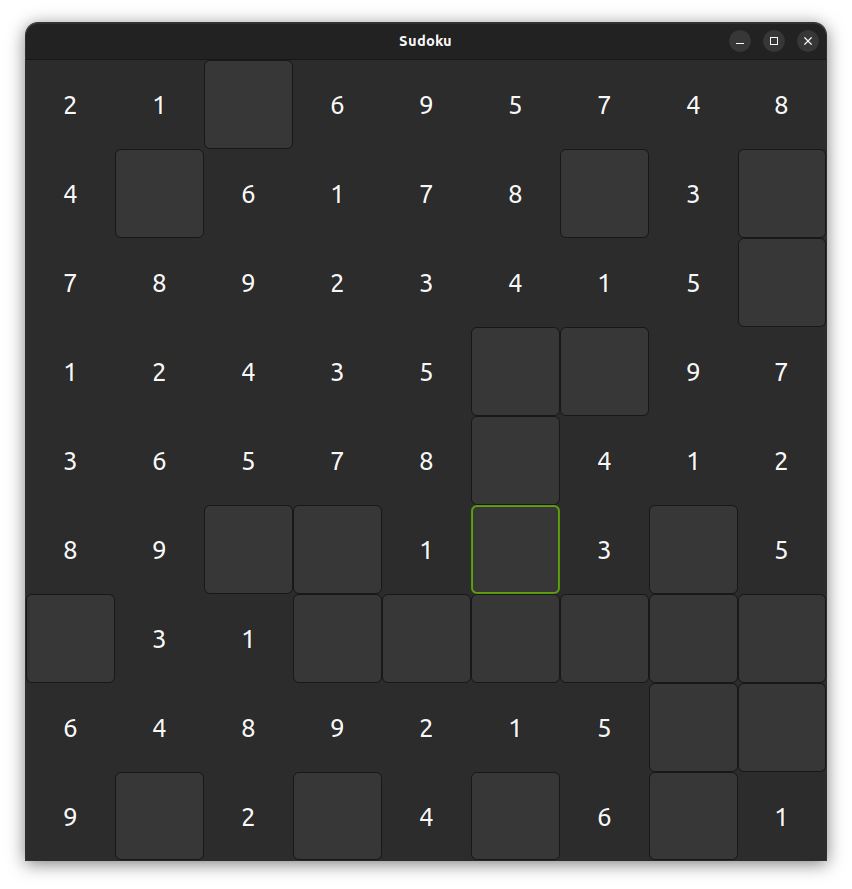

# Sudoku

Welcome to my first ever **Rust** project! 🎉

## Project Overview

In this project, I have implemented a **Sudoku generator and solver** using a **backtracking algorithm**.

Additionally, I've created a **simple user interface (UI)** using **GTK** to visualize the Sudoku grid. While the UI is still a work in progress, the solver is fully functional.

## Features

- **Backtracking Algorithm**: The core of the solver, which efficiently finds solutions by exploring possibilities and backtracking when a constraint is violated.
- **Simple GTK UI**: A basic interface to visualize the Sudoku grid.
